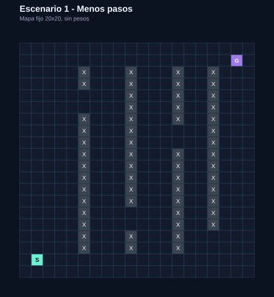
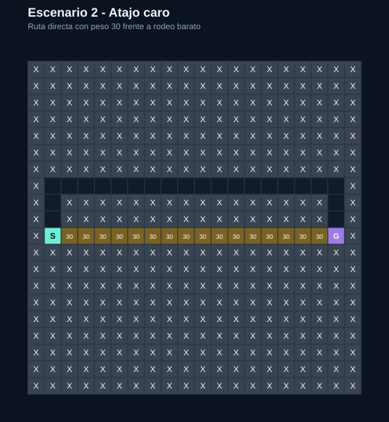
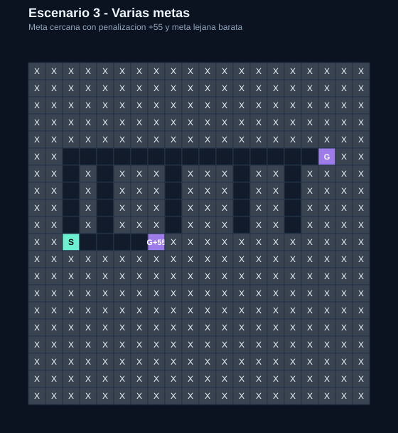
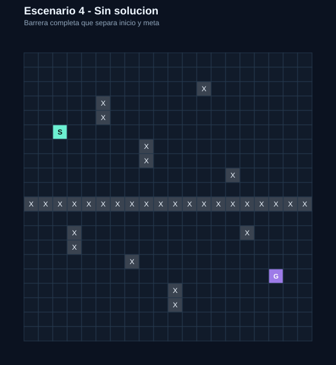

# MAZE-LAB

Aplicación web interactiva para visualizar y comparar algoritmos de búsqueda sobre un laberinto editable.

## Objetivo

El objetivo del proyecto es entender de forma visual cómo funcionan distintos algoritmos de búsqueda utilizados en Inteligencia Artificial. El usuario puede crear un mapa, colocar un punto de inicio, una o varias metas, obstáculos y casillas con peso, y observar cómo cada algoritmo explora el tablero y encuentra una ruta.

## Tecnologías utilizadas

- **HTML**: estructura de la página.
- **CSS**: diseño visual, distribución de paneles y estilos del tablero.
- **JavaScript**: lógica del programa, algoritmos, edición del mapa, métricas y animaciones.
- **GitHub**: control de versiones y almacenamiento del código.
- **Netlify**: despliegue público del proyecto.

## Algoritmos implementados

### BFS · Búsqueda en anchura
Explora el mapa por capas. Cuando todas las casillas tienen el mismo coste, encuentra una ruta con el menor número de pasos. No utiliza los pesos para decidir.

### DFS · Búsqueda en profundidad
Avanza todo lo posible por una rama antes de retroceder. Puede encontrar una solución, pero no garantiza que sea la ruta más corta ni la de menor coste.

### UCS · Búsqueda de coste uniforme
Explora primero el camino con menor coste acumulado. Tiene en cuenta los pesos y, con costes no negativos, encuentra una ruta de coste mínimo.

### A*
Combina el coste acumulado con una heurística Manhattan que estima la distancia hasta la meta. En este proyecto se mueve solo arriba, abajo, izquierda y derecha.

### Búsqueda bidireccional · mejora extra
Realiza una búsqueda desde el inicio y otra desde la meta o metas hasta que ambas fronteras se encuentran. Es útil en mapas sin pesos porque puede reducir la profundidad que debe recorrer cada búsqueda. En esta implementación se usa como búsqueda por pasos y **no optimiza costes ponderados**.

## Funcionalidades principales

- Tablero de **20 × 20** por defecto.
- Tamaño configurable entre 5 y 60 para el modo libre.
- Inicio, múltiples metas, obstáculos y pesos editables.
- Movimiento ortogonal, sin diagonales.
- Coste base 1 y pesos configurables entre 2 y 99.
- Penalización no negativa en metas de los escenarios preparados.
- Visualización de exploración y ruta final.
- Animación de un coche recorriendo la solución.
- Simular, pausar, continuar, detener y reiniciar.
- Control de velocidad.
- Comparación de BFS, DFS, UCS y A* sobre el mismo mapa.
- Métricas de pasos, coste, casillas exploradas, descubiertas y frontera.
- Modo claro y oscuro.
- Música electrónica generada en el navegador.
- Cuatro escenarios **fijos y reproducibles**.
- Búsqueda bidireccional como mejora adicional.

## Escenarios reproducibles

Los cuatro botones cargan siempre el mismo mapa de 20 × 20. De esta forma los resultados pueden repetirse y compararse.

### 1 · Menos pasos
Sin pesos. Hay varios caminos de distinta longitud. BFS encuentra la ruta mínima en pasos y DFS puede seguir una ruta bastante más larga.



### 2 · Atajo caro
La ruta directa tiene 16 casillas con peso 30. Existe un rodeo más largo, pero de coste mucho menor.



### 3 · Varias metas
La meta cercana añade una penalización de +55. La segunda meta está más lejos, pero llegar a ella cuesta menos.



### 4 · Sin solución
Una barrera completa separa el inicio de la meta.



## Comparación de los cuatro escenarios

Resultados obtenidos con la lógica actual del proyecto:

| Escenario | Algoritmo | Pasos | Coste | Exploradas |
|---|---|---:|---:|---:|
| Menos pasos | BFS | 34 | 34 | 340 |
| Menos pasos | DFS | 100 | 100 | 165 |
| Menos pasos | UCS | 34 | 34 | 340 |
| Menos pasos | A* | 34 | 34 | 144 |
| Atajo caro | BFS | 17 | 481 | 35 |
| Atajo caro | DFS | 17 | 481 | 18 |
| Atajo caro | UCS | 23 | 23 | 24 |
| Atajo caro | A* | 23 | 23 | 24 |
| Varias metas | BFS | 5 | 60 | 14 |
| Varias metas | DFS | 5 | 60 | 6 |
| Varias metas | UCS | 20 | 20 | 38 |
| Varias metas | A* | 20 | 20 | 33 |
| Sin solución | BFS | — | — | 194 |
| Sin solución | DFS | — | — | 194 |
| Sin solución | UCS | — | — | 194 |
| Sin solución | A* | — | — | 194 |

Conclusiones principales:

- En **Menos pasos**, BFS obtiene 34 pasos y DFS 100.
- En **Atajo caro**, BFS elige 17 pasos pero paga coste 481; UCS y A* recorren 23 pasos con coste 23.
- En **Varias metas**, BFS alcanza la meta cercana con coste 60; UCS y A* prefieren la meta lejana y terminan con coste 20.
- En **Sin solución**, los cuatro algoritmos terminan sin encontrar ruta.

## Pruebas realizadas

Se han comprobado los casos obligatorios:

- **Ruta simple:** se encuentra correctamente una ruta entre inicio y meta.
- **Ausencia de meta:** la aplicación no inicia la búsqueda y muestra un aviso.
- **Varias metas:** BFS prioriza la meta que requiere menos pasos.
- **Pesos:** UCS y A* tienen en cuenta el coste.
- **Optimalidad con pesos no negativos:** en una prueba anterior, UCS y A* obtuvieron **21 pasos y coste 21**. UCS exploró 168 casillas y A* 74.
- **Obstáculos:** las rutas los rodean y nunca los atraviesan.
- **Mapa sin solución:** la búsqueda termina e informa que no existe ruta.
- **Edición después de ejecutar:** al modificar el tablero y volver a simular, se calcula una nueva solución.
- **Pausa y continuación:** la simulación continúa desde el mismo punto.
- **Velocidad:** en el mismo recorrido, a 97 casillas/s la animación tardó 3,7 s y a 200 casillas/s 1,8 s, manteniendo 87 casillas exploradas, 34 pasos y coste 34.
- **Búsqueda bidireccional:** se ha añadido como mejora extra y puede seleccionarse desde la interfaz.

## Estructura del proyecto

```text
MAZE-LAB/
├── index.html
├── styles.css
├── script.js
├── README.md
└── docs/
    ├── escenario-1-menos-pasos.svg
    ├── escenario-2-atajo-caro.svg
    ├── escenario-3-varias-metas.svg
    └── escenario-4-sin-solucion.svg
```

- **index.html**: estructura y controles de la interfaz.
- **styles.css**: diseño visual y adaptación de la página.
- **script.js**: tablero, BFS, DFS, UCS, A*, búsqueda bidireccional, métricas, escenarios y animaciones.
- **docs/**: evidencias visuales de los cuatro escenarios reproducibles.

## Cómo ejecutar el proyecto

### Opción 1 · Abrir directamente

Descarga o clona el repositorio y abre `index.html` en el navegador.

### Opción 2 · Servidor local con Python

```bash
python -m http.server 8000
```

Después abre:

```text
http://localhost:8000
```

## Enlaces

- **Repositorio:** https://github.com/raineragoge/MAZE-LAB
- **Netlify:** https://mazeprojectlab.netlify.app/

## Limitaciones

- La búsqueda bidireccional añadida como mejora se basa en pasos y no busca el menor coste cuando existen pesos.
- El tiempo mostrado en la interfaz corresponde a la animación, no a una medición de rendimiento puro del algoritmo.
- El botón Aleatorio sigue generando mapas variables; los cuatro escenarios de evaluación son independientes y reproducibles.

## Uso de IA

Se utilizó ChatGPT como apoyo para proponer estructuras, generar y corregir código, revisar la rúbrica y preparar pruebas. Las propuestas se revisaron y se comprobaron manualmente en la aplicación. Entre los cambios realizados a partir de la revisión están la mejora visual del tablero, la animación del coche, las pruebas obligatorias, la conversión de los cuatro escenarios a mapas reproducibles y la búsqueda bidireccional.

## Estado

La aplicación incluye los cuatro algoritmos obligatorios, los cuatro escenarios reproducibles, pruebas documentadas, GitHub, despliegue en Netlify y la búsqueda bidireccional como mejora adicional.
